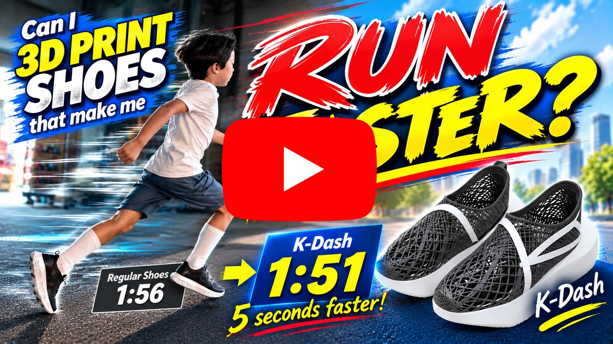

<!-- README.md | Project overview and navigation | Introduce the K-Dash research project. -->

# K-Dash: Fully DIY 3D-Printed Running Shoes Designed for Speed

  

  

This summer research project was conceived by Kanata, a third-grade elementary school student. By scanning his own feet and learning about shoe design from his running club coach, he is taking on the challenge of making K-Dash: fully DIY running shoes designed for speed, using AI, 3D CAD, and a 3D printer. His father offers technical suggestions and support with scanning, CAD, material selection, and printing.

## Research Goals

Explore the design features of shoes intended for faster running while making running shoes that fit his own feet.

- Investigate the raised toe, thick sole, and plate features described by the coach.
- Examine commercially available shoes for design ideas.
- Scan his feet in 3D and design closely fitting uppers.
- Find suitable 3D-printing settings through small prototypes and material comparisons.
- Incorporate a polycarbonate plate that can be made at home into the sole.

## Filament Used in the Final Version

- Filament: [Siraya Tech Flex TPU Air Active Foaming 3D Printer Filament](https://www.amazon.co.jp/dp/B0DZCD4Z9M)
- Colors: White and Black
- Nozzle diameter: 0.6 mm

## Research → Design → Build

### 1. Learn from the Coach and Examine Commercial Shoes

  
  

The coach explained that shoes designed for faster running feature raised toes, thick soles, and plates. We examined actual shoes at an Adidas store in Tokyo and used these features as references for our own shoes.

  

### 2. Turn His Feet into 3D Data

  
  
  

We scanned both feet with Heges and an iPhone's TrueDepth sensor at approximately 0.5 mm accuracy. After removing unwanted areas such as the floor, we prepared the foot models for designing the uppers.

### 3. Design with AI and 3D CAD

  
  

We designed the shoes in Autodesk Fusion. By describing the desired shapes to AI and using its help to operate Fusion through MCP, we explored fitted uppers, a raised toe shape, and a honeycomb structure to reduce weight.

### 4. Iterate with 3D-Printed Prototypes

  
  
  

We first printed only the uppers on a FlashForge AD5X to check the fit. For the final version, we used White and Black Siraya Tech Flex TPU Air with a 0.6 mm nozzle. Soft TPU was challenging to print, so we made many prototypes while adjusting the temperature, nozzle diameter, and filament feeding method.

### 5. Insert a Polycarbonate Plate into the Sole

  
  

Because carbon plates are difficult to fabricate at home, we used polycarbonate plates that could be made with a 3D printer. We paused the sole print, placed the plate inside, and resumed printing to embed it in the TPU.

## Folder Structure

| Location | Contents |
| --- | --- |
| [`docs/report/`](docs/report/) | Research report, A3 sketchbook layouts, and sample comments for parents. |
| [`docs/sole-ai/`](docs/sole-ai/) | Technical notes on AI-assisted sole design, lattice structures, and 3D printing. |
| [`images/report/`](images/report/) | Research photos, screenshots, and their descriptions. |
| [`images/3d-cad/`](images/3d-cad/) | Shoe design renderings created with AI and 3D CAD. |
| [`3d-models/`](3d-models/) | Uppers, soles, plates, and slicer profiles for 3D printing. |
| [`sole-ai/`](sole-ai/) | Python tools and tests for generating left and right sole design candidates. |

## Read the Research Report

Descriptions of the research images are collected in [images/report/README.md](images/report/README.md). For the ten-page A3 portrait sketchbook layout, see [docs/report/a3-sketchbook-layout/README.md](docs/report/a3-sketchbook-layout/README.md).

## Sole Design Tools

`sole-ai` is a tool for exploring left and right sole shapes, plate placement, and internal lattice structures. See [sole-ai/README.md](sole-ai/README.md) for usage and design assumptions.

Intermediate candidate data is stored in `sole-ai/outputs/`, and generated files such as PDFs are stored in `output/`. These are not tracked in Git.

## Safety

The 3D models in this repository are intended for research and prototyping. Before running in the shoes, thoroughly check component strength, bonding, and fit. Decide whether to use them for long-distance running or competition only after verifying their safety.
