# 自分の足に合う3Dプリント・ランニングシューズ

  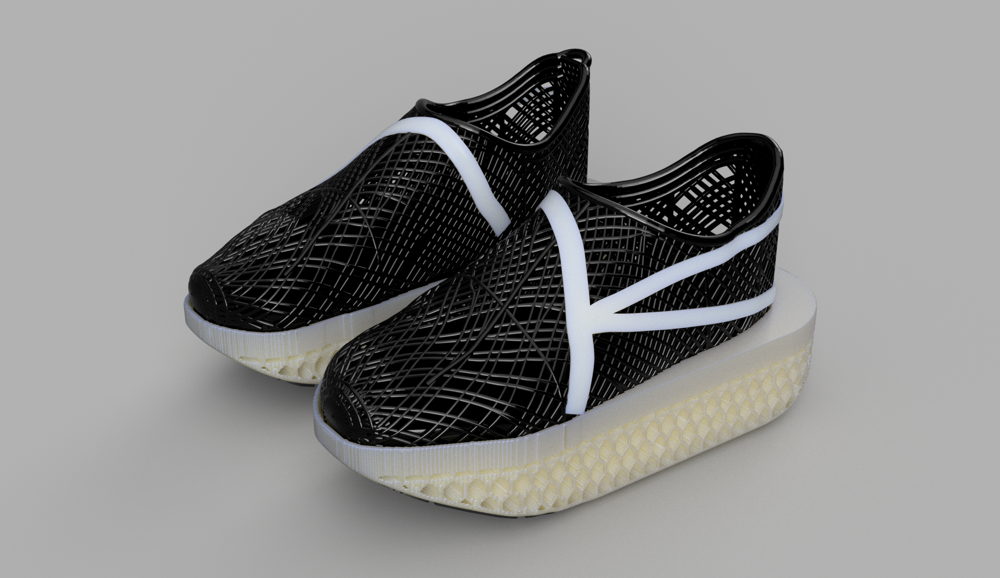

小学3年生のかなたくんが発案した、夏休みの自由研究プロジェクトです。自分の足を3Dスキャンし、ランニングクラブのコーチに教えてもらった靴の工夫を参考に、AI・3D CAD・3Dプリンタを使ってランニングシューズ作りに挑戦します。父親は、スキャン、CAD、材料選び、プリントなどの技術面を提案・支援しています。

## 研究の目的

自分の足にフィットするランニングシューズを作りながら、速く走るための靴にはどのような工夫があるのかを調べます。

- コーチから聞いた、つま先が上がった形、厚いソール、プレートの工夫を調べる。
- 実際の市販シューズを観察し、自分の設計の参考にする。
- 足を3Dスキャンし、ぴったり合うアッパーを設計する。
- 小さな試作と材料の比較をくり返し、3Dプリントの条件を見つける。
- 家で加工できるポリカーボネートのプレートをソールに組み込む。

## 調べる → 設計する → 作る

### 1. コーチに聞き、市販シューズで確かめる

  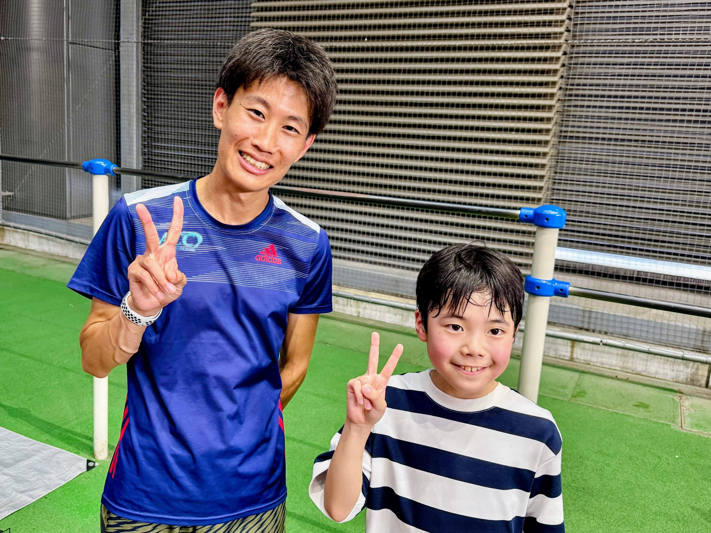
  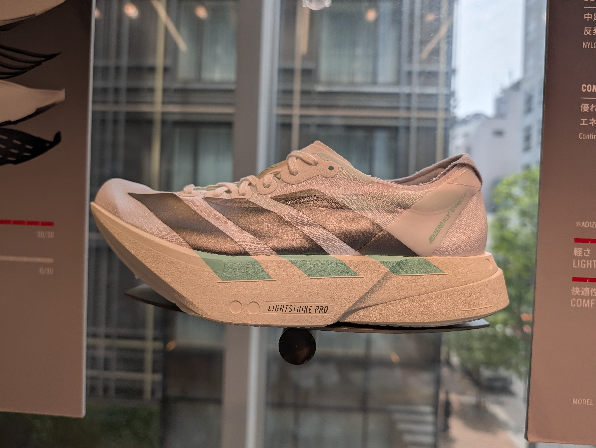

コーチから、速く走るための靴には「つま先が上がった形」「厚いソール」「プレート」という工夫があると教えてもらいました。Adidasストア東京で実物を観察し、これらの工夫を自分のシューズの参考にしました。

  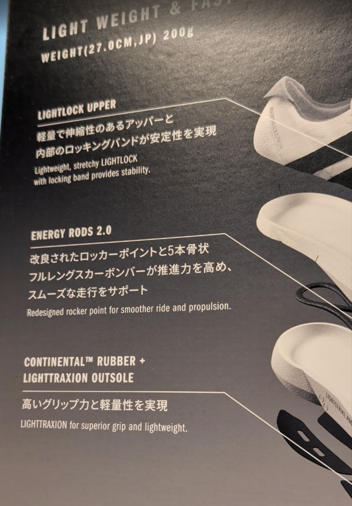

### 2. 自分の足を3Dデータにする

  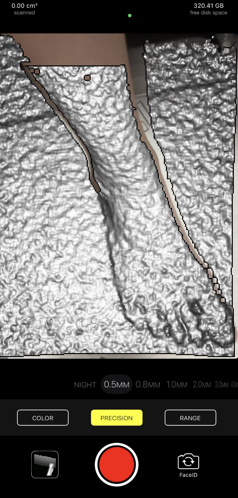
  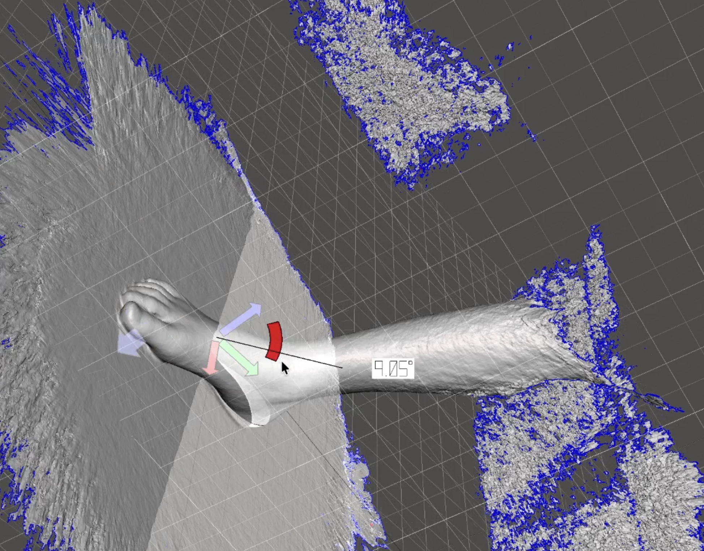
  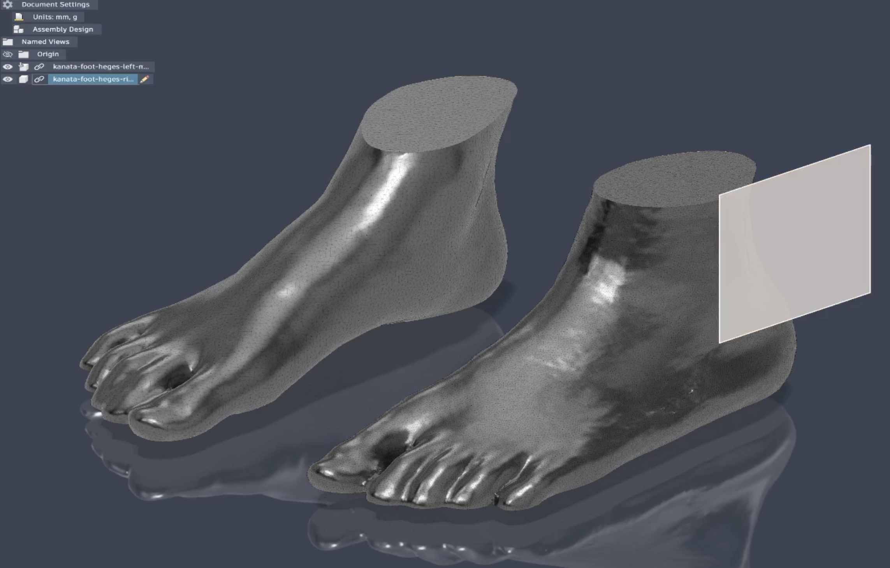

HegesとiPhoneのTrueDepthセンサーを使い、両足を約0.5 mmの精度でスキャンしました。床などの不要な部分を取り除き、アッパーを設計できる足の3Dデータに整えました。

### 3. AIと3D CADでデザインする

  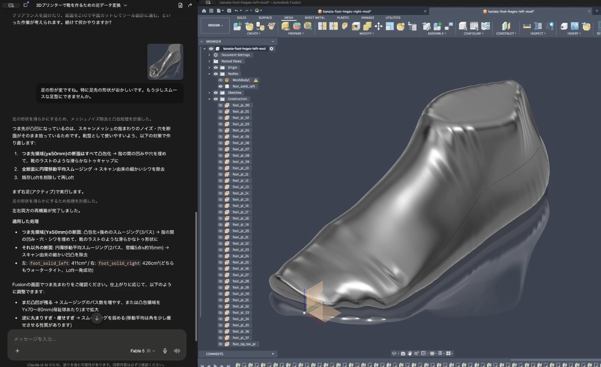
  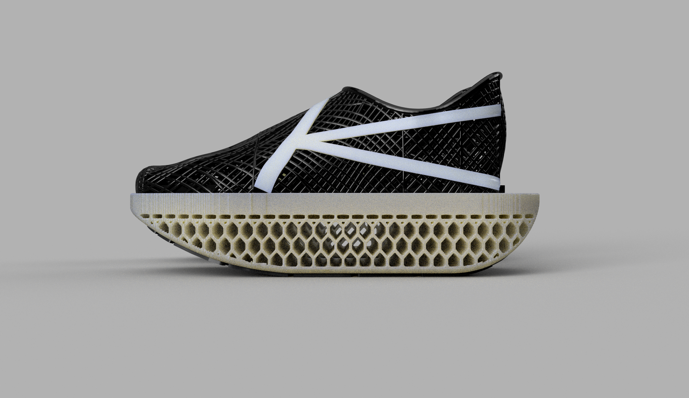

Autodesk Fusionで靴を設計しました。AIには作りたい形を伝え、MCP経由でFusionの操作を手伝ってもらいながら、足に合うアッパー、つま先が上がった形、軽くするためのハニカム構造を検討しました。

### 4. 3Dプリンタで試作をくり返す

  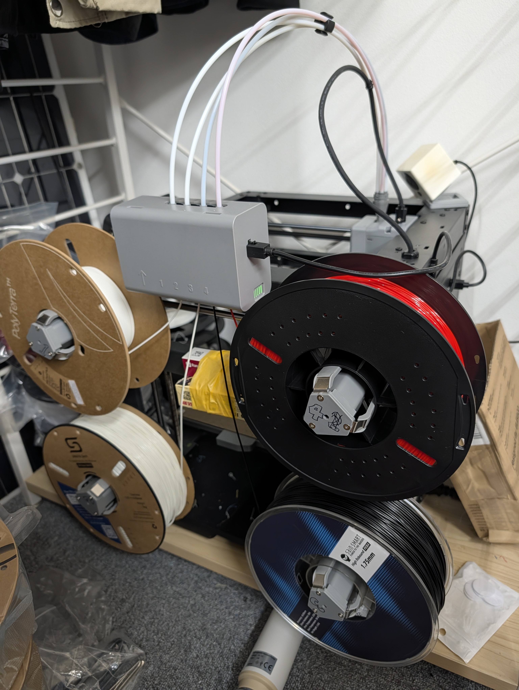
  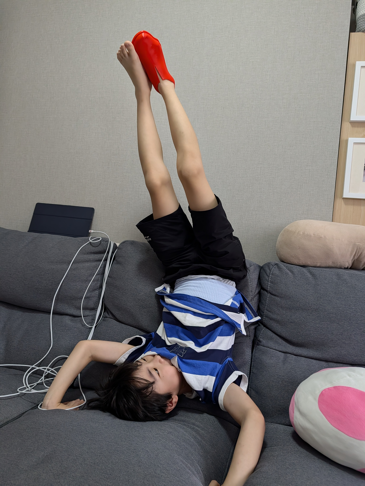
  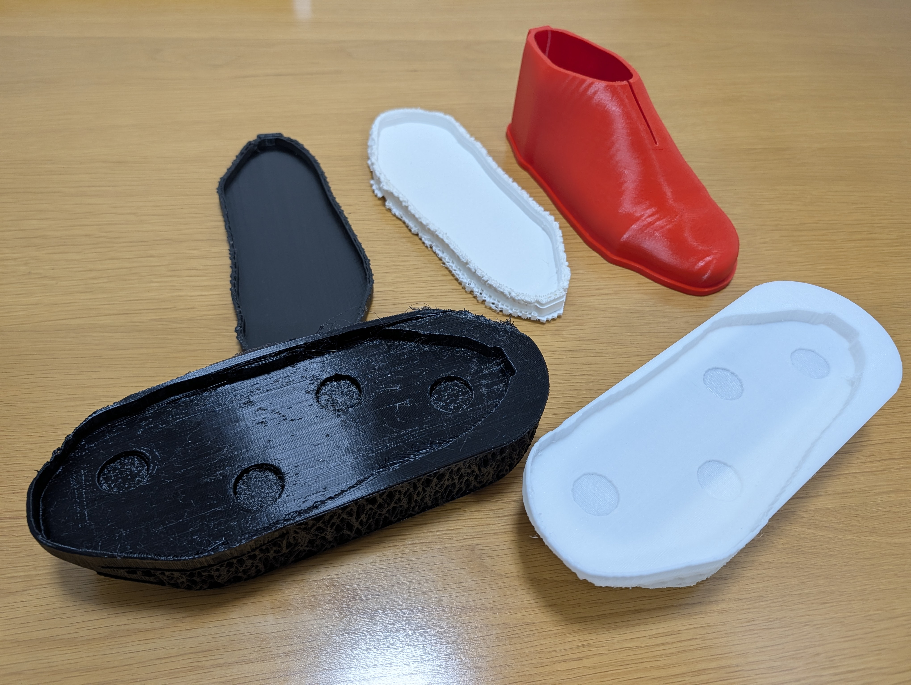

FlashForge AD5Xで、まずアッパーだけをプリントしてフィット感を確認しました。柔らかいTPUは難しく、温度、ノズル径、フィラメントの送り方を調整しながら、何度も試作をくり返しました。

### 5. ポリカーボネートのプレートをソールに入れる

  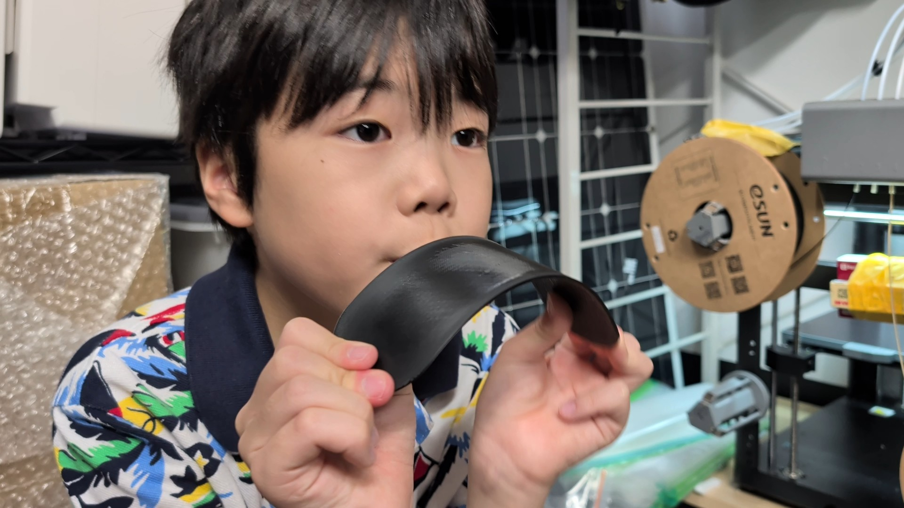
  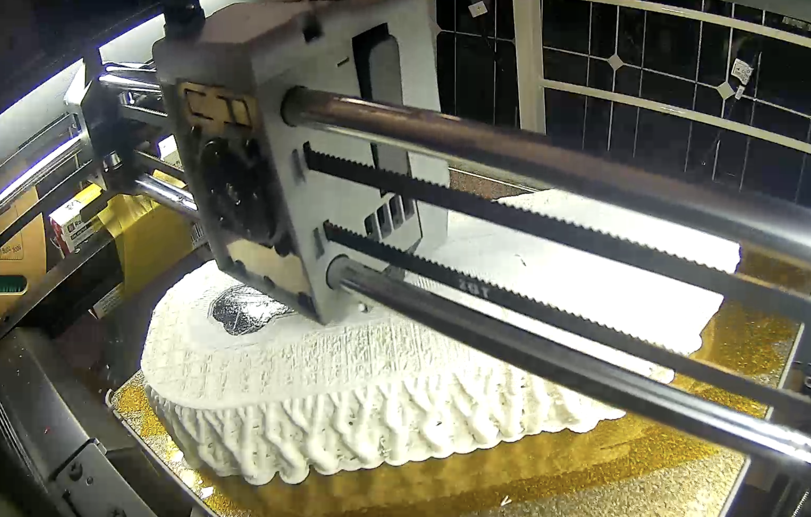

カーボンプレートの加工は家では難しいため、3Dプリンタで作れるポリカーボネートのプレートを使いました。ソールのプリントを途中で止めてプレートを置き、再開することで、TPUの中にプレートを組み込みました。

## フォルダ構成

| 場所 | 内容 |
| --- | --- |
| [`docs/report/`](docs/report/) | 自由研究のまとめ、A3スケッチブック用レイアウト、保護者向けコメント例。 |
| [`docs/sole-ai/`](docs/sole-ai/) | AIを使ったソール設計と、格子構造・3Dプリントに関する技術メモ。 |
| [`images/report/`](images/report/) | 自由研究に使う写真・画面キャプチャと、その説明集。 |
| [`images/3d-cad/`](images/3d-cad/) | AIと3D CADで作成したシューズの完成イメージ。 |
| [`3d-models/`](3d-models/) | 3Dプリント用のアッパー、ソール、プレート、スライサープロファイル。 |
| [`sole-ai/`](sole-ai/) | 左右のソール設計候補を作るPythonツールとテスト。 |

## 自由研究を読む

自由研究で使う画像の説明は、[images/report/README.md](images/report/README.md) にまとめています。A3縦長スケッチブック10ページ分のレイアウトは、[docs/report/a3-sketchbook-layout/README.md](docs/report/a3-sketchbook-layout/README.md) を参照してください。

## ソール設計ツール

`sole-ai` は、左右それぞれのソール形状、プレートの配置、内部の格子構造を検討するためのツールです。使い方や設計上の前提は、[sole-ai/README.md](sole-ai/README.md) に記載しています。

生成途中の候補データは `sole-ai/outputs/`、PDFなどの出力物は `output/` に保存し、Gitでは管理しません。

## 安全について

このリポジトリの3Dモデルは研究・試作用です。実際に走る前には、部品の強度、接着状態、フィット感を十分に確認します。長距離走や競技での使用は、安全性を確かめたあとに判断します。
